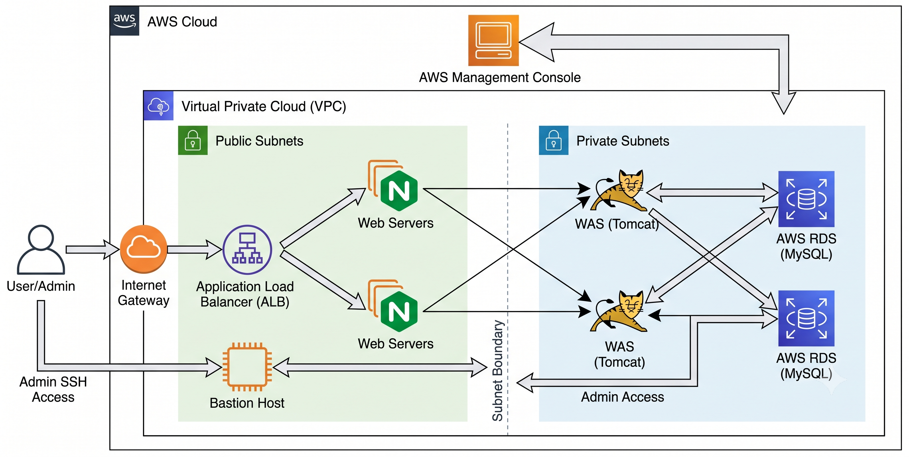

# AWS Auto Infra

A CloudShell-first Terraform project that deploys a secure training 3-tier application in `ap-northeast-2`.

```text
Internet → Route 53 → ALB (HTTPS) → Nginx (2A / 2C) → Tomcat (2A / 2C) → private RDS MySQL
                                           ▲
Admin network → Bastion ───────────────────┘
```



The project uses two Availability Zones for Nginx and Tomcat, one NAT Gateway and a single-AZ RDS instance to keep a lab deployment affordable. The ALB is the only public application endpoint. Nginx, Tomcat, and RDS are not directly reachable from the internet.

## What is automated

- Terraform installation in CloudShell when it is missing, including release checksum verification.
- Per-account S3 Terraform state backend with versioning, SSE-S3 encryption, public-access blocking, and state locking.
- VPC, public/private subnets, IGW, NAT Gateway, route tables, security groups, Bastion, Nginx, Tomcat, private RDS MySQL, and ALB.
- ACM certificate request, Route 53 DNS validation, HTTP-to-HTTPS redirect, and Route 53 alias records for the apex and `www` domains.
- An RDS-backed JSP board with input validation, parameterized SQL, escaped output, and a database health endpoint.
- English progress logs under `outputs/` and an English interactive menu.

## Prerequisites

- AWS CloudShell with AWS CLI credentials for `ap-northeast-2`.
- A public Route 53 hosted zone already delegated to the apex domain you enter, such as `example.com`. If `www.example.com` is entered, the TUI automatically uses `example.com`.
- An existing EC2 key pair in `ap-northeast-2`.
- IAM permission to create the listed VPC, EC2, IAM, ELBv2, RDS, ACM, Route 53, Secrets Manager, and S3 resources. The first run must also be able to configure the generated S3 state bucket.

No ACM certificate, RDS password, Terraform installation, or state bucket is required beforehand.

## CloudShell usage

```bash
git clone https://github.com/AR0NICA/kwu-aws-auto-infra.git
cd kwu-aws-auto-infra
chmod +x auto_infra.sh scripts/lib.sh
./auto_infra.sh
```

The menu accepts the following actions:

1. **Create infrastructure** — enter the Route 53 domain and EC2 key-pair name. The script validates both before Terraform applies the stack.
2. **Delete all infrastructure** — enter the same domain and key-pair name, then confirm. RDS is deleted without a final snapshot.
3. **Test ALB and application connectivity** — enter the domain. The script verifies two healthy ALB targets and retries the HTTPS database-health endpoint.
4. **Exit** — makes no AWS changes.

The successful create output includes the HTTPS URLs, ALB DNS name, Bastion public IP, private RDS endpoint, and the board health URL. Open `https://<your-domain>/app/` to use the board.

After a successful create, the script exits immediately instead of waiting for application health checks. DNS, ALB target health, and Tomcat startup can settle independently; start the script again and use menu option 3 when you want to run the explicit connectivity test.

## Security model

| Layer | Allowed inbound traffic |
| --- | --- |
| ALB | HTTP 80 and HTTPS 443 from the internet |
| Nginx | HTTP 80 from the ALB; SSH 22 from Bastion |
| Tomcat | TCP 8080 from Nginx; SSH 22 from Bastion |
| RDS | MySQL 3306 from Tomcat only |

Nginx 2A renders a blue operational landing page and Nginx 2C renders a red one. Refreshing the root domain can therefore show ALB traffic moving between the two healthy edge nodes.

RDS is private, encrypted, and uses `manage_master_user_password`; the generated password stays in Secrets Manager. Tomcat reads only that secret through a least-privilege instance role. No database credential is stored in Terraform variables, logs, source files, or browser responses.

The Bastion SSH rule defaults to the CloudShell egress IP detected during creation. To authorize another fixed administrator network without changing the code, set it before starting the script:

```bash
export AUTO_INFRA_ADMIN_CIDR='203.0.113.10/32'
./auto_infra.sh
```

## State and deletion

Terraform state is stored per domain at:

```text
s3://aws-auto-infra-tfstate-<account-id>-ap-northeast-2/deployments/<domain>/terraform.tfstate
```

Delete uses Terraform state only; it never searches by broad tags or deletes unrelated AWS resources. It removes the selected deployment’s state versions after a successful destroy and removes the backend bucket only when it was created by this project and is empty. The Route 53 hosted zone and the EC2 key pair are user-owned prerequisites and are retained.

## Costs and lifecycle

This project creates billable resources: a NAT Gateway, ALB, five EC2 instances, RDS MySQL, and a small S3 state backend. The current lab defaults are one NAT Gateway, single-AZ RDS, no RDS backups, and no final RDS snapshot. Use menu option 2 when the lab is no longer required.

## Repository structure

```text
auto_infra.sh             # single interactive entry point
scripts/lib.sh            # Terraform bootstrap, validation, TUI actions, logging
terraform/
  modules/network/        # VPC, subnets, NAT, and routing
  modules/security/       # least-privilege security groups
  modules/database/       # private RDS and managed password
  modules/compute/        # EC2, IAM role, Nginx, Tomcat board templates
  modules/load_balancer/  # ALB, target group, HTTP/HTTPS listeners
  modules/dns/            # Route 53 lookup and ACM DNS validation
outputs/                  # ignored runtime logs
.auto-infra/              # ignored generated runtime configuration
```

## Verification for maintainers

Run these checks after Terraform is available:

```bash
bash -n auto_infra.sh scripts/lib.sh
terraform -chdir=terraform fmt -check -recursive
terraform -chdir=terraform init -backend=false
terraform -chdir=terraform validate
```

Do not run `terraform apply` directly. The entry script supplies the generated backend configuration, validates the domain and key pair, and writes the non-secret runtime variable file.

## License

This project is licensed under the [MIT License](LICENSE).
