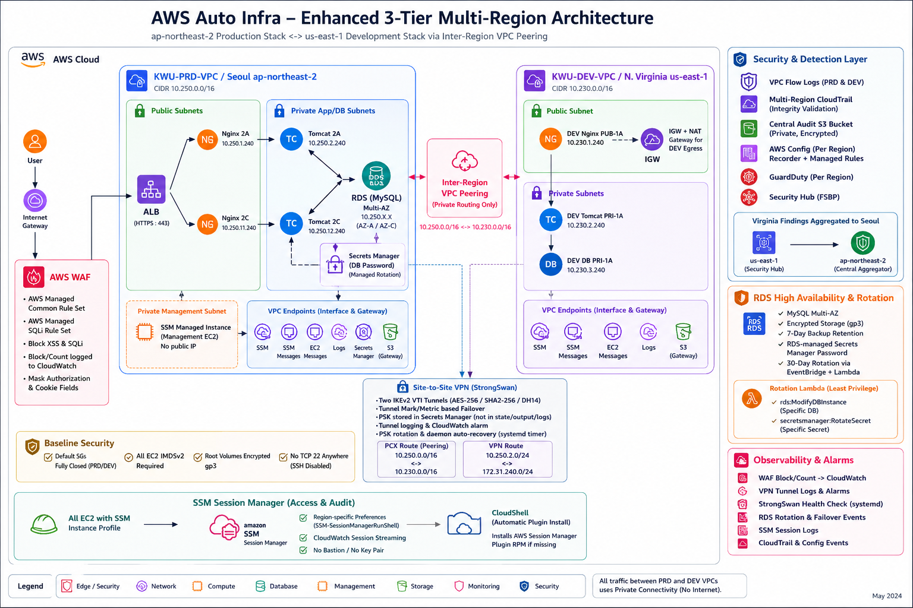

# AWS Auto Infra

> Kwangwoon University: Practice-Oriented Information Security & Cloud Network Specialist Training Program

<p>
  
  
  
  
  <a href="LICENSE"></a>
</p>

A CloudShell-first Terraform project that builds a security-focused AWS training environment across Seoul and Northern Virginia. It combines a production-style 3-tier web application, an on-premises simulation VPC, inter-Region VPC Peering, and a dual-tunnel StrongSwan Site-to-Site VPN.

```text
Internet → Route 53 → WAF → ALB (HTTPS) → Nginx 2A/2C → Tomcat 2A/2C → Multi-AZ RDS MySQL

KWU-PRD-VPC 10.250.0.0/16 ⇄ Inter-Region PCX ⇄ KWU-DEV-VPC 10.230.0.0/16
PRD 10.250.2.0/24        ⇄ AWS Site-to-Site VPN ⇄ StrongSwan ⇄ DEV 172.31.240.0/24
```

## Architecture



| Area | Configuration |
| --- | --- |
| Production | `ap-northeast-2`, two Availability Zones, ALB, Nginx, Tomcat, Multi-AZ RDS |
| Development / on-premises simulation | `us-east-1`, EC2 lab tiers, StrongSwan customer gateway, VPN test network |
| Private connectivity | Inter-Region VPC Peering plus AWS Site-to-Site VPN |
| Administrative access | AWS Systems Manager Session Manager; no Bastion, SSH key pair, or TCP 22 rule |
| Security and audit | WAF, Flow Logs, CloudTrail, AWS Config, GuardDuty, Security Hub |
| State | Versioned and encrypted S3 backend with native S3 state locking |

## What the project automates

- Installs Terraform `1.15.6` in CloudShell when needed and verifies the HashiCorp release checksum.
- Creates a per-account S3 backend with versioning, SSE-S3 encryption, public-access blocking, bucket-owner enforcement, and state locking.
- Builds the Seoul production VPC with public edge subnets, private application/database subnets, an Internet Gateway, a NAT Gateway, route tables, and closed default security groups.
- Deploys two Nginx nodes, two private Tomcat nodes, a private SSM management node, a public ALB, and private Multi-AZ RDS MySQL.
- Builds the Northern Virginia DEV VPC with Nginx, Tomcat, MariaDB, a private VPN test node, NAT egress, and a StrongSwan customer gateway.
- Creates inter-Region VPC Peering between `10.250.0.0/16` and `10.230.0.0/16` with bidirectional private routes.
- Creates a dedicated dual-tunnel IKEv2 VPN path between `10.250.2.0/24` and `172.31.240.0/24` without conflicting with PCX routes.
- Requests an ACM certificate, creates Route 53 validation records, redirects HTTP to HTTPS, and creates apex and `www` alias records.
- Deploys an RDS-backed JSP message board and exposes database health at `/app/health.jsp`.
- Provides an English TUI and timestamped execution logs under `outputs/`.

## Security and audit

### Edge and network protection

- A Regional AWS WAF Web ACL protects the ALB with `AWSManagedRulesCommonRuleSet` and `AWSManagedRulesSQLiRuleSet`.
- WAF blocks common XSS, SQL injection, and baseline web exploits by default.
- WAF logging retains BLOCK, COUNT, and EXCLUDED_AS_COUNT events in CloudWatch Logs. Authorization and Cookie headers are redacted.
- VPC Flow Logs record ACCEPT and REJECT traffic in both VPCs. The custom format includes subnet, packet source/destination, flow direction, and traffic-path fields for PCX and VPN analysis.
- Terraform adopts and empties the default security group in each project VPC.

| Target | Allowed inbound traffic |
| --- | --- |
| ALB | TCP 80 and 443 from the internet; WAF evaluates requests first |
| PRD Nginx | TCP 80 from the ALB security group |
| PRD Tomcat | TCP 8080 from the Nginx security group |
| RDS | TCP 3306 from the Tomcat security group |
| PRD management node | No inbound rules; Session Manager only |
| DEV Nginx | Lab HTTP/HTTPS access and ICMP from PRD over PCX |
| DEV Tomcat / MariaDB | Tier-specific internal traffic and ICMP from PRD over PCX |
| StrongSwan | UDP 500/4500 and ESP from the two AWS tunnel endpoint `/32` addresses; protected VPN networks only |
| DEV VPN test node | ICMP from the PRD network |

Every EC2 instance requires IMDSv2 and uses an encrypted gp3 root volume. The stack contains no EC2 key-pair references and no TCP 22 ingress rules.

### Audit and threat detection

- Multi-Region CloudTrail records read/write management events, global service events, and log-file validation data.
- CloudTrail and AWS Config share a private audit bucket with TLS enforcement, versioning, SSE-S3, and a 90-day lifecycle.
- AWS Config records both Regions continuously and evaluates Flow Logs, WAF, CloudTrail, SSM registration, RDS Multi-AZ/encryption, Secrets Manager rotation, and default security groups.
- GuardDuty runs in Seoul and Northern Virginia. Optional paid protection plans that the lab does not need are explicitly disabled.
- Security Hub enables AWS Foundational Security Best Practices and aggregates Virginia findings into the Seoul home Region.

GuardDuty detectors, Security Hub accounts, AWS Config recorders and delivery channels, Session Manager account preferences, and the Security Hub finding aggregator are account- or Region-scoped resources. The TUI stops before `terraform plan` when it finds an unmanaged conflict. Import an existing resource into the Terraform address reported by the preflight check before continuing.

AWS Config rules evaluate the account, not only resources tagged by this project. Unrelated resources can therefore produce `NON_COMPLIANT` results even when both project VPC default security groups are closed.

## Session Manager and VPC endpoints

The project replaces Bastion SSH access with Systems Manager Session Manager.

- All EC2 roles include `AmazonSSMManagedInstanceCore`.
- Region-specific `SSM-SessionManagerRunShell` preferences stream session activity to CloudWatch Logs.
- The TUI installs the AWS Session Manager plugin from the official AWS-signed RPM when CloudShell does not already have it.
- PRD Interface Endpoints: SSM, SSMMessages, EC2Messages, CloudWatch Logs, and Secrets Manager.
- DEV Interface Endpoints: SSM, SSMMessages, EC2Messages, and CloudWatch Logs.
- Both VPCs use an S3 Gateway Endpoint.
- Endpoint security groups accept HTTPS only from managed-node security groups, including the StrongSwan node.

## Database availability and credential rotation

- RDS MySQL uses two private database subnets, encrypted storage, Multi-AZ failover, and seven-day backup retention.
- RDS manages the master password in Secrets Manager and performs its native rotation cycle.
- EventBridge invokes a least-privilege Lambda every 30 days to request an additional RDS-managed password rotation.
- The Lambda can modify only the managed DB instance and rotate only its associated secret. It never reads the password.
- Each Tomcat node checks the `AWSCURRENT` secret VersionId every minute. When the version changes, it atomically replaces a mode-0600 systemd environment file and restarts Tomcat.
- Database credentials never appear in Terraform variables, source files, user-data output, Terraform outputs, or browser responses.
- The board uses prepared statements, server-side length checks, and HTML output escaping.

The classroom deletion workflow does not create a final RDS snapshot. Do not use this default for persistent workloads.

## VPC Peering and StrongSwan VPN

PCX and VPN routes use separate destination networks.

| Path | PRD side | DEV side | TUI packet test |
| --- | --- | --- | --- |
| VPC Peering | `10.250.0.0/16` | `10.230.0.0/16` | PRD management node to DEV Nginx, Tomcat, and MariaDB |
| Site-to-Site VPN | `10.250.2.0/24` | `172.31.240.0/24` | Bidirectional ICMP between the PRD management node and DEV VPN test node |

The VPN connects a Virtual Private Gateway in Seoul to a StrongSwan EC2 customer gateway in Northern Virginia.

- Two route-based IKEv2 VTI tunnels
- AES-256, SHA2-256, and DH group 14
- Per-tunnel marks and route metrics for active/failover routing
- DPD restart and automatic tunnel startup
- AWS-managed PSKs stored in Secrets Manager instead of Terraform state or user-data
- A systemd timer that reloads rotated PSKs and recovers a stopped StrongSwan daemon
- CloudWatch tunnel logs and per-tunnel `TunnelState` alarms

## Prerequisites

- AWS CloudShell with valid credentials
- `AWS_REGION=ap-northeast-2`
- `AUTO_INFRA_DEV_REGION=us-east-1`, or its default value
- An existing delegated public Route 53 hosted zone for the apex domain you enter
- IAM permissions for VPC, EC2, IAM, ELBv2, WAFv2, RDS, ACM, Route 53, S3, CloudWatch Logs, CloudTrail, AWS Config, GuardDuty, Security Hub, Systems Manager, Secrets Manager, Lambda, EventBridge, and Site-to-Site VPN
- Permission to create the AWS service-linked roles required by the enabled services
- Sufficient quotas for two NAT Gateways, VPC endpoint ENIs, Elastic IP addresses, EC2, Multi-AZ RDS, ALB, and Site-to-Site VPN

You do not need an EC2 key pair, Bastion, ACM certificate, database password, Terraform installation, or Terraform state bucket before the first run.

Entering `www.example.com` is safe; the TUI normalizes it to the apex domain `example.com`. The subnet Availability Zones are fixed, so PRD must use `ap-northeast-2` and DEV must use `us-east-1`.

## CloudShell usage

```bash
git clone https://github.com/AR0NICA/kwu-aws-auto-infra.git
cd kwu-aws-auto-infra
chmod +x auto_infra.sh scripts/lib.sh
export AWS_REGION=ap-northeast-2
./auto_infra.sh
```

The TUI provides seven actions:

1. `Create infrastructure`: enter the Route 53 domain. The script saves a plan and applies that exact plan, then exits after a successful deployment.
2. `Delete all infrastructure`: enter the domain and confirm permanent deletion of the Terraform-managed deployment and audit data.
3. `Test ALB and application connectivity`: verify both ALB targets, `/app/`, and RDS connectivity through the health endpoint.
4. `Test VPC Peering connectivity`: verify PCX status and routes, then send private ICMP traffic from the PRD management node to all three DEV lab tiers through SSM Run Command.
5. `Test StrongSwan VPN connectivity`: wait up to 15 minutes for tunnel convergence, verify both route directions and StrongSwan IKE state, then run bidirectional encrypted ICMP tests.
6. `Start SSM management session`: open an audited shell on the private PRD management node.
7. `Exit`: leave without changing AWS resources.

DNS validation, EC2 user-data, RDS, AWS Config, and the VPN tunnels can take time to converge after the Terraform apply completes. Start the TUI again and run options 3, 4, and 5 when you are ready to test each path.

## State and deletion behavior

Terraform stores one state per domain:

```text
s3://aws-auto-infra-tfstate-<account-id>-ap-northeast-2/deployments/<domain>/terraform.tfstate
```

Deletion uses the selected Terraform state only. It does not search for broad tags or remove unrelated resources. After a successful destroy, the script removes that state object's versions and delete markers. It removes the backend bucket only when the project created it and the bucket is empty. The Route 53 hosted zone remains user-owned.

Menu option 2 also deletes project-managed GuardDuty findings, Security Hub settings, AWS Config history, Flow/WAF/Session logs, and CloudTrail audit objects. Change the audit bucket's `force_destroy` policy and the deletion workflow before using this project where audit retention is mandatory.

## Cost notice

This is not a free-tier stack. A default deployment includes:

- Two NAT Gateways, one ALB, ten EC2 instances, and public IPv4 usage
- Multi-AZ RDS MySQL and backup storage
- Ten PRD Interface Endpoint ENIs across two Availability Zones, four DEV Interface Endpoint ENIs, and two S3 Gateway Endpoints
- WAF Web ACL and managed-rule request processing
- VPC Flow Logs and CloudWatch Logs ingestion and storage
- AWS Config evaluations, GuardDuty, Security Hub, and Site-to-Site VPN
- CloudTrail/S3 audit storage, Secrets Manager, Lambda, EventBridge, and inter-Region data transfer

Use menu option 2 when the lab is finished. Before deletion, confirm that no account-level security service managed by this state is needed by another workload.

## Repository structure

```text
auto_infra.sh                 # Single interactive entry point
scripts/lib.sh                # Bootstrap, preflight checks, TUI actions, tests, and logging
terraform/
  modules/network/            # PRD VPC, subnets, NAT, routing, and closed default SG
  modules/security/           # Tier-specific security groups
  modules/compute/            # SSM EC2, Nginx/Tomcat, and board templates
  modules/database/           # Private Multi-AZ RDS and managed secret
  modules/load_balancer/      # ALB, target group, and HTTP/HTTPS listeners
  modules/dns/                # Route 53 lookup and ACM DNS validation
  modules/waf/                # Managed WAF rules and filtered request logging
  modules/session_manager/    # Session preferences and audit log groups
  modules/vpc_endpoints/      # Interface and S3 Gateway Endpoints
  modules/rotation/           # RDS managed-password rotation Lambda and schedule
  modules/dev_environment/    # Virginia lab VPC and VPN test subnet
  modules/peering/            # Inter-Region PCX and static routes
  modules/vpn/                # VGW, AWS VPN, StrongSwan VTI, logs, and alarms
  modules/vpc_flow_logs/      # Regional VPC traffic logging
  modules/audit/              # Audit S3 bucket, CloudTrail, and Config IAM role
  modules/config/             # Regional recorder, delivery channel, and managed rules
  modules/threat_detection/   # GuardDuty, Security Hub, and finding aggregation
  tests/fresh_plan.tftest.hcl # Mock-provider fresh-plan regression test
outputs/                      # Ignored runtime logs
.auto-infra/                  # Ignored generated variables and saved plan
```

## Maintainer verification

Install the locked providers, then run:

```bash
bash -n auto_infra.sh scripts/lib.sh
terraform -chdir=terraform fmt -check -recursive
terraform -chdir=terraform init -backend=false
terraform -chdir=terraform validate
terraform -chdir=terraform test
python3 -c 'import ast, pathlib; p=pathlib.Path("terraform/modules/rotation/lambda/handler.py"); ast.parse(p.read_text(), filename=str(p))'
git diff --check
```

`terraform test` uses mock AWS providers and does not access an AWS account, S3 backend, or live resource. Use TUI option 1 for real deployments so the script can validate the domain, backend, Regions, and account-level service conflicts before applying the saved plan.

## License

This project is available under the [MIT License](LICENSE).
